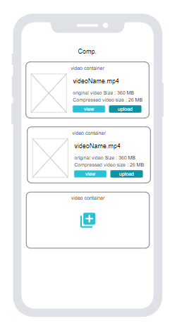
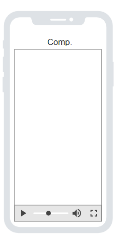

# comp

video compress App with Flutter 


1- init an empty project
2- Add Flutter Packages
3- init IOS and Android
4- draw wireframe
5- start with view

## wireframe

#### video Container in main Screen

 

#### video Player



wireframe link 
```
https://app.moqups.com/bO2jKvSTFx6Hei47OoIS1wAV1aSALpR9/view/page/a880590a1
```