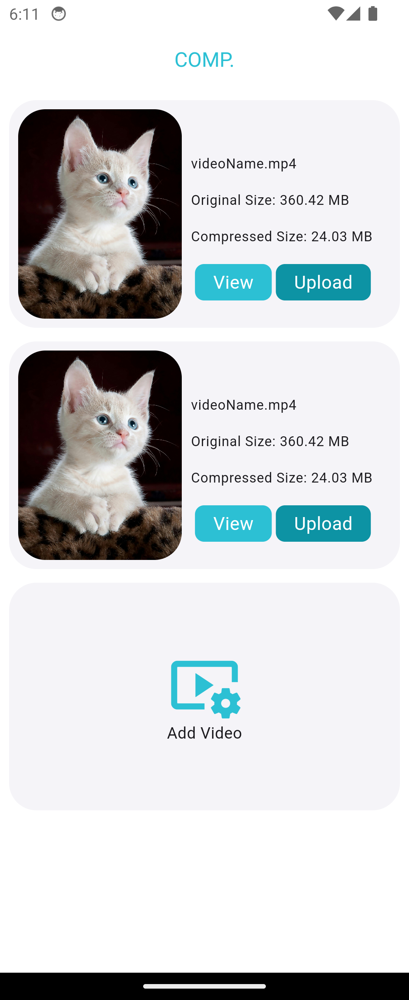
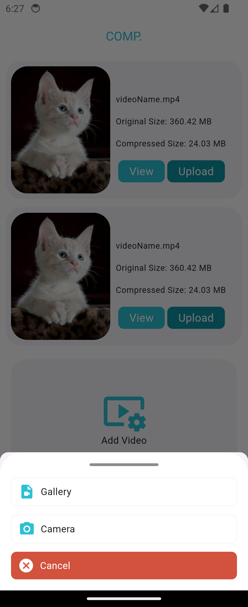

# comp

video compress App with Flutter 


1- init an empty project

2- Add Flutter Packages

3- init IOS and Android

4- draw wireframe

5- start with view

6- refactor code, done main screen 

7- navigation, bottomsheet camera or gallery

8- add cubit (flutter_bloc) , compress video 


## wireframe

#### video Container in main Screen

 

wireframe link 
```
https://app.moqups.com/bO2jKvSTFx6Hei47OoIS1wAV1aSALpR9/view/page/a880590a1
```


#### Final View

   


demo apk 

```
https://drive.google.com/file/d/1Grek6ecfOGCkBeGiirPVgE8RM0Fjb6ov/view?usp=sharing
```